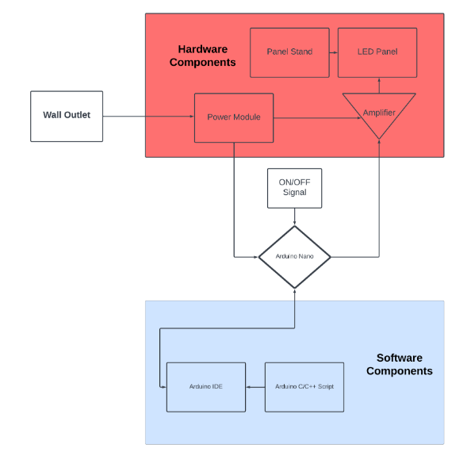
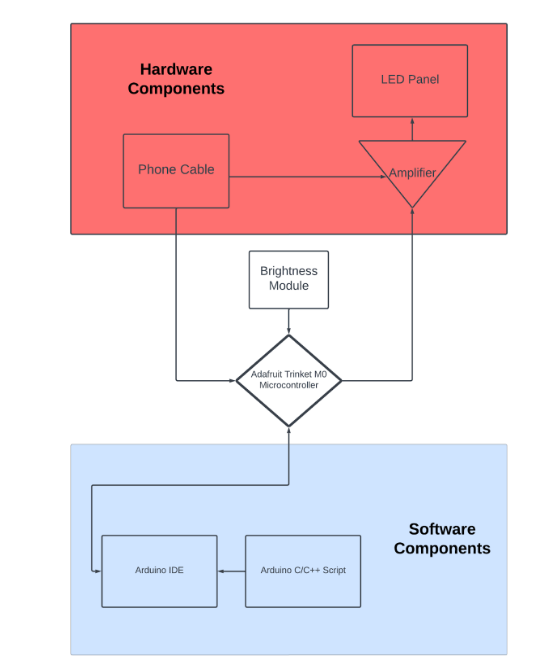

# EC464 Senior Project: 40Hz Light Therapy

This README includes a brief overview and an introduction to how to get started on our project. 

## Project Overview

### Introduction

This project aims to develop an LED panel capable of emitting a consistent 40Hz flickering light. The 40Hz frequency is particularly chosen based on research suggesting its potential benefits in neurotherapeutic applications, especially for enhancing cognitive functions and possibly impacting disorders like Alzheimer's disease.

### Objectives

The primary objective of this project is to design and construct a reliable, efficient LED panel system that can maintain precise flicker frequencies, especially targeting the 40Hz range. Key goals include:

 - Precision: Achieve exact control over flicker frequency to ensure consistent 40Hz output.
 - Safety: Ensure the panel operates safely under all conditions, including extensive usage scenarios.
 - User-Friendliness: Develop a control interface that allows users to easily adjust and set the brightness as needed.

### Current State

The project has reached a significant milestone with the development of two final product models:

 - **T0 Model:** This is the base model featuring a large LED panel that can simply turn on and off, designed for stationary use where size and portability are not constraints.
 - **T9 Model:** A compact, innovative model that can attach to any modern smartphone case using Velcro. The T9 not only offers portability but also includes adjustable flickering brightness settings, making it ideal for personal use in a variety of settings.

## Installation

Installation comes in two parts: the software and the hardware. Here are the steps to help you get a quick-start on our project:

1. First you should install the software part of the project. Please refer to the Installation section under the [README_software.md](README_software.md) file
2. Next, you can set up the hardware of the project. Please refer to the section named "_Setting up the product_" under the [README_hardware.md](README_hardware.md) file. If you need help acquiring the materials needed, under the same file there is a Bill of Materials (BOM) section where you can find all the materials you will need for the project.
3. After completing all these steps, you should be all set for installment!

## System Overview

For this product we have 2 different models catered towards different purposes. The base model, which is the T0, is our very first version for our client’s needs, which serves to be a simple LED panel supported by a stand. We then have the T9 model that is more streamlined and compact compared to the T0 model, and serves for a more user-friendly experience.

### T0

The phone would be attached onto the panel using an integrated phone holder, and at the back of the panel is where the power button resides. Simply, press it and the user will be able to use their phone without having to hold it, while being exposed to 40Hz light that is proven to help with Alzheimer’s Disease and dementia. The figure down below shows that we have the power supply being the wall outlet connected to the power module that will help power up the circuit. The panel stand will hold the LED panel, in which we have an Arduino Nano as the microcontroller connecting the hardware and software components that will act as the controller to transfer an ON/OFF signal into the LED panel. 

 
  
[View PDF of T0 System Architecture](media/system_architecture/T0_System_architecture.pdf)

### T9

The figure down below is the overall system block diagram for the T9 model. It is a lot more streamlined and compact compared to the T9 model and is tailored more towards user’s convenience and needs. It has a phone cable that connects the phone into the microcontroller, which takes input of the brightness module and sends the corresponding signal to adjust the brightness of the LED accordingly. The software components for both models stay relatively the same as they are both compatible with Arduino code. 

  
[View PDF of T9 System Architecture](media/system_architecture/T9_system_architecture.pdf)

   
