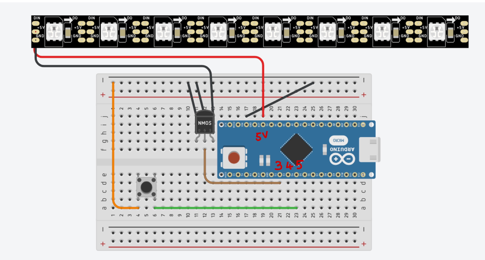
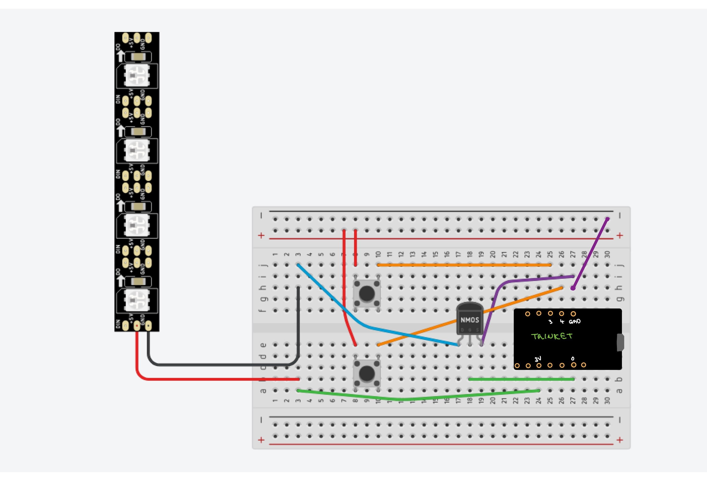
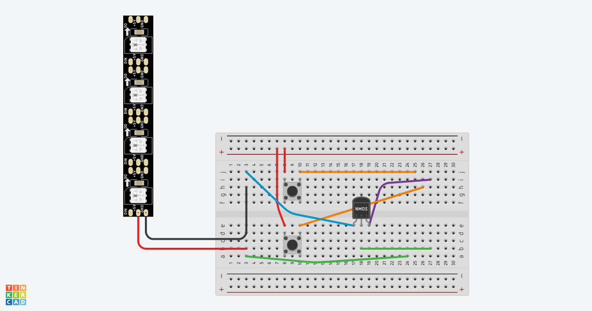

# OptiSync 40Hz LED Panel

## Description
Brief description of your project, what it does, and any other relevant information.

## Hardware Schematics

### Circuit Diagram for T0 
This is our circuit diagram for the T0 model. It uses pins 3, 4, and 5 as inputs and pins 5V and Ground as outputs. The circuit diagram illustrates an Arduino Nano wired with a button and a MOSFET towards an LED.

### Circuit Diagram for T9
This is our circuit diagram for the T9 model. It uses pins 0, 3, and 4 as inputs and pins 3V and Ground as outputs. The circuit diagram illustrates an Arduino Nano wired with 2 buttons and a MOSFET towards an LED.

### CAD Design of T0 Housing
This is the CAD design for our T0 Housing. It consist of one button integrated along with an area for users to plug in the power cable to turn on the model. We have also uploaded the .stl file under the _CAD_ folder. 

### CAD Design of T9 Housing
This is the CAD design for our T9 Housing. It consist of 2 buttons integrated, along with a hollow bridge that allows the wires to run from the circuit board to the LED that is placed along the small panel above. It also has an open area to allow users to plug in their power cable. The .stl file is under the _CAD_ folder. 

#### PDF Version
You can view the detailed PDF version of the CAD design here:
[PDF CAD Design](url-to-cad-design.pdf)

#### CAD File (.STL)
Download the STL file for the CAD design here:
[STL CAD File](url-to-cad-file.stl)

## Installation
Instructions on how to setup or install your project.

## Usage
How to use the project or any scripts included.

## Contributing
Guidelines for how to contribute to the project.

## License
Specify the license under which the project is released.

## Schematics

