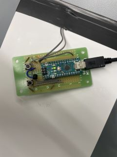
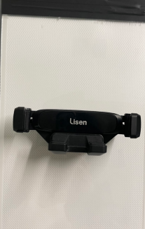

# Hardware Schematics

## Circuit Diagram 

### T0
This is our circuit diagram for the T0 model. It uses pins 3, 4, and 5 as inputs and pins 5V and Ground as outputs. The circuit diagram illustrates an Arduino Nano wired with a button and a MOSFET towards an LED.

[View PDF of T0 Circuit Diagram](hardware_diagrams/T0_Circuit_Diagram.pdf)

### T9
This is our circuit diagram for the T9 model. It uses pins 0, 3, and 4 as inputs and pins 3V and Ground as outputs. The circuit diagram illustrates an Arduino Nano wired with 2 buttons and a MOSFET towards an LED.

[View PDF of T9 Circuit Digram](hardware_diagrams/T9_Circuit_Diagram.pdf)

## CAD Design

### T0 Housing

## Emily should send the .stl files and replace that with this
This is the CAD design for our T0 Housing. It consist of one button integrated along with an area for users to plug in the power cable to turn on the model. We have also uploaded the .stl file under the _hardware_diagrams/CAD_ folder. 

 [View PDF of T0 Housing 1](hardware_diagrams/CAD/T0_Housing_1.pdf)   
   
 [View PDF of T0 Housing 2](hardware_diagrams/CAD/T0_Housing_2.pdf)    
   
 [View PDF of T0 Housing 3](hardware_diagrams/CAD/T0_Housing_3.pdf)    

#### CAD File (.STL) 
Download the STL file for the T0 Model CAD design here: 
- [T0 STL CAD File (1/3)](hardware_diagrams/CAD/T9_Trinket_housing_cover.stl)
- [T0 STL CAD File (2/3)](hardware_diagrams/CAD/T9_Trinket_housing.stl)
- [T0 STL CAD File (3/3)](hardware_diagrams/CAD/T9_prototyping_board_housing.stl)

### T0 Panel Stand
We used a pre-existing CAD design for a panel stand. This design allows 5 different angle configurations for the user to use the panel at whichever height they desire. We have also uploaded the .stl file under the _hardware_diagrams/CAD_ folder. 

 [View PDF of T0 Stand Arm](hardware_diagrams/CAD/T0_Stand_Arm.pdf)   
   
 [View PDF of T0 Stand Hook](hardware_diagrams/CAD/T0_Stand_Hook.pdf)    
   
 [View PDF of T0 Stand Bottom](hardware_diagrams/CAD/T0_Stand_Bottom.pdf)    

#### CAD File (.STL)
Download the STL file for the T0 Model CAD design here: _Emily should send the .stl files and replace that with this_
- [T0 Stand STL CAD File (1/3)](hardware_diagrams/CAD/T0_Stand_Arm.stl)
- [T0 Stand STL CAD File (2/3)](hardware_diagrams/CAD/T0_Stand_Bottom.stl)
- [T0 Stand STL CAD File (3/3)](hardware_diagrams/CAD/T0_Stand_Hook.stl)
  
### T9
This is the CAD design for our T9 Housing. It consist of 2 buttons integrated, along with a hollow bridge that allows the wires to run from the circuit board to the LED that is placed along the small panel above. It also has an open area to allow users to plug in their power cable. The .stl file is under the _hardware_diagrams/CAD_ folder. 

#### CAD File (.STL)
Download the STL file for the T9 Model CAD design here:
- [T9 STL CAD File (1/3)](hardware_diagrams/CAD/T9_Trinket_housing_cover.stl)
- [T9 STL CAD File (2/3)](hardware_diagrams/CAD/T9_Trinket_housing.stl)
- [T9 STL CAD File (3/3)](hardware_diagrams/CAD/T9_prototyping_board_housing.stl)

# Bill of Materials (BOM)
The following table includes a detailed list of all the materials used in the project, along with vendor information for each component:

| Item No. | Component                    | Quantity | Vendor Name        | Part Number | Price  |
|----------|------------------------------|----------|--------------------|-------------|--------|
| 1        | Adafruit Trinket M0 Trinket  | 1        | Adafruit           | 3500        | $8.95  |
| 2        | Arduino Nano + Cable         | 1        | Arduino            | A000005     | $24.90 | 
| 3        | Prototype Circuit Board      | 2        | Amazon             | B081MSKJJX  | $7.99  |
| 4        | LED Strip                    | 2        | Amazon             | B0C9919Z7Q  | $14.99 |
| 5        | LED Panel                    | 1        | Amazon             | B09VTCG1ZR  | $14.99 |
| 6        | Wires                        | 10-15    | Boston University  | N/A         | N/A    |
| 7        | Button                       | 3        | Boston University  | N/A         | N/A    |
| 8        | MOSFET                       | 2        | Boston University  | N/A         | N/A    |
| 9        | Velcro                       | 1        | Amazon             | 085-03-0026 | $9.29  |
| 8        | Micro-USB to USB-C Cable     | 1        | Amazon             | B094RDLNDB  | $9.99  |

## Vendor Information
Below is additional information about the vendors from whom components were purchased:

- **Adafruit Industries**
  - **Website:** [Adafruit.com](https://www.adafruit.com)
  - **Contact:** support@adafruit.com
  - **Phone:** (646) 248-7822

- **Arduino**
  - **Website:** [Arduino.cc](http://arduino.cc)
  - **Contact:** support@arduino.cc
  - **Phone:** N/A

- **Amazon**
  - **Website:** [Amazon.com](https://www.amazon.com/)
  - **Contact:** [Amazon Contact Page](https://www.amazon.com/gp/css/contact-us-access/ref=cu_surl_text_trace)
  - **Phone:** 1-888-280-4331
  - 

# Power Requirements

This section outlines the power specifications required to operate the 40Hz LED Panel effectively.

##T0 
### Voltage Requirements
- **Operating Voltage:** 5V
- **Minimum Voltage:** 5V
- **Maximum Voltage:** 12V

### Current Requirements
- **Operating Current:** X A
- **Peak Current:** X A (during operation)
- **Standby Current:** X A (when idle)

### Power Supply Model
- **Recommended Power Supply:** [Model XYZ](link-to-power-supply-datasheet)
- **Manufacturer:** Manufacturer Name

### Power Consumption
- **Typical Power Consumption:** X Watts
- **Maximum Power Consumption:** X Watts (under full load)

##T9

### Additional Notes
- Make sure to use a power supply that matches or exceeds the required specifications.
- Avoid exposing the device to voltages above the maximum rating to prevent damage.
- For optimal performance, ensure stable current delivery especially during peak usage.

# System Pictures

This section provides a clear view of the system inside the enclosure. 

## T0 (inside enclosure)

These are pictures of the system circuit for the T0 model. This is what is inside the enclosure, before we placed a housing over it. The pictures displays the circuit board with the components that we used for the T0 model.

## T9 (inside enclosure)

The picture below shows the system for the T9 model. The two yellow wires are the power and ground wires connecting towards the LED. 

## T0 (with enclosure)

These are pictures of the system circuit for the T0 model. This is what is inside the enclosure, before we placed a housing over it. The pictures displays the circuit board with the components that we used for the T0 model.

## T9 (with enclosure)

The video below is a full demonstration of the T9 model. It is small and compact and there are buttons in the back that are used to adjust the brightness intensity of the LED. 

# Notes
## Datasheets
 - [Datasheet for Trinket M0](https://cdn-learn.adafruit.com/downloads/pdf/adafruit-trinket-m0-circuitpython-arduino.pdf)
 - [Datasheet for Arduino Nano](https://docs.arduino.cc/resources/datasheets/A000005-datasheet.pdf)

## Web resources
 - [Arduino Nano Documentation](https://docs.arduino.cc/hardware/nano/)
 - [Operating LED Documentation](https://img.kwcdn.com/product-file-public/1fa3201b30/e1cf93ef936620d4e02b9221dc2b4623.pdf?_x_sessn_id=po0ericp0z&refer_page_name=goods&refer_page_id=10032_1714006419912_5y583ihzke&refer_page_sn=10032)
 - [Adafruit Trinket M0 Documentation](https://www.play-zone.ch/en/fileuploader/download/download/?d=1&file=custom%2Fupload%2FFile-1507818705.pdf)

   

