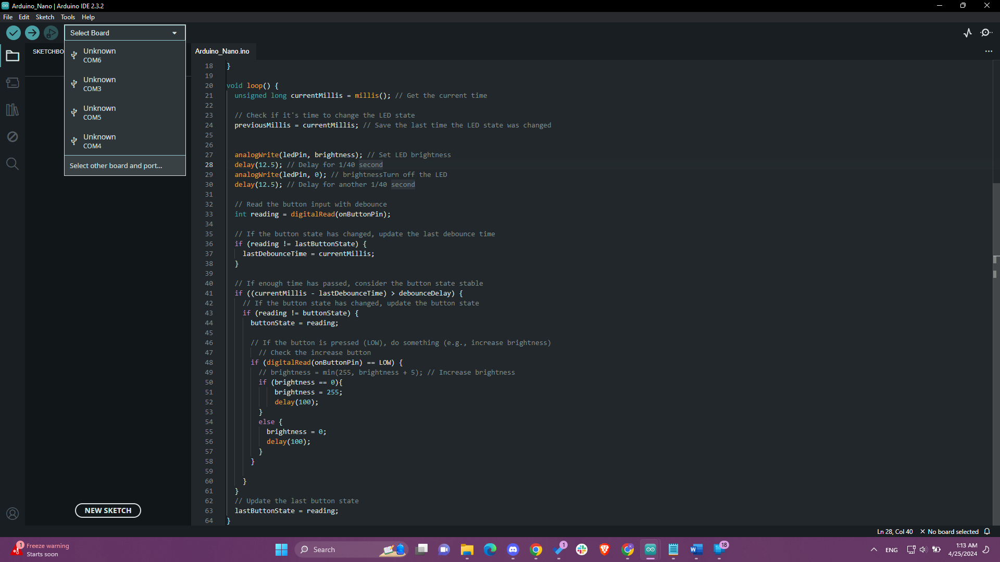
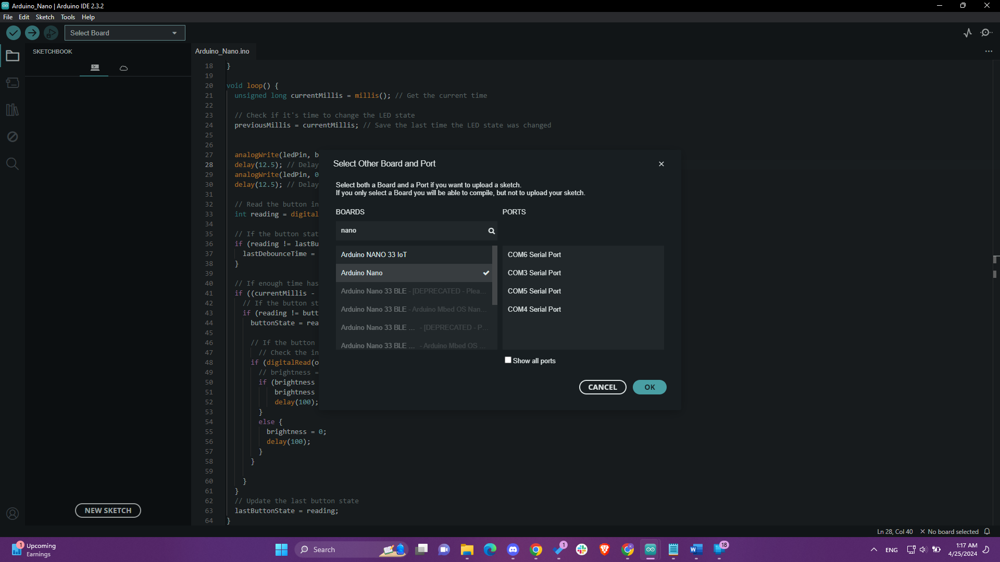
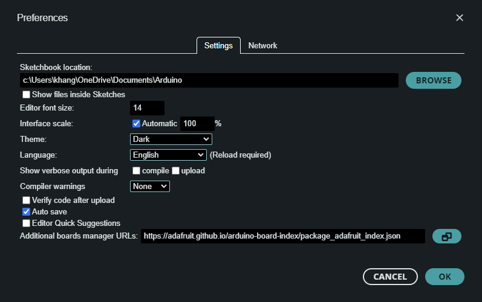
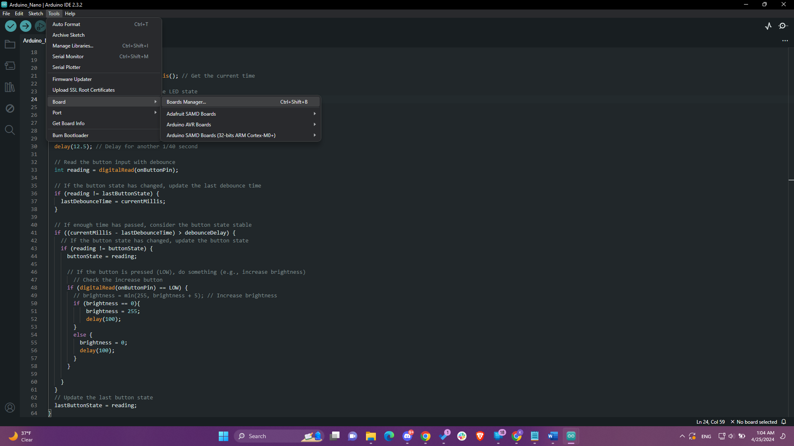
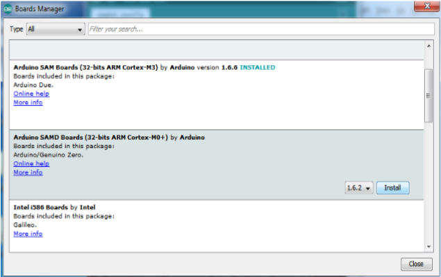
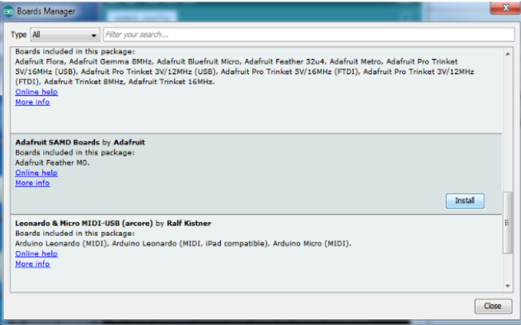
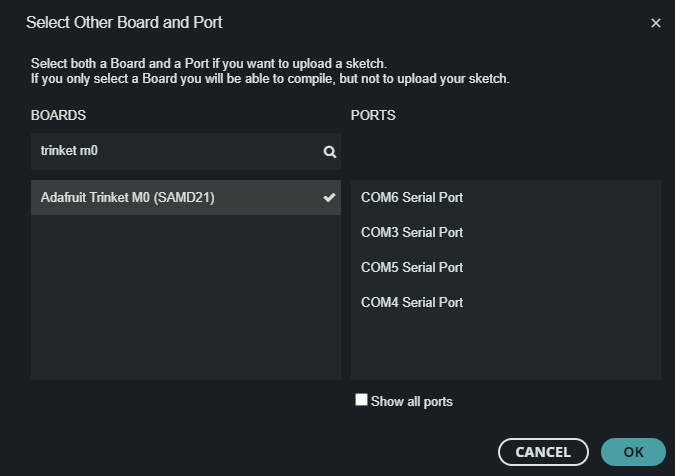

# Software

Since our project is mainly hardware, there is not much documentation needed for the software aspect of this project.

## Files

There are 2 files we have developed on Arduino IDE of file type: .ino, each of which are in charge of controlling our two microcontrollers: Arduino Nano and Adafruit Trinket M0. They .ino files are named respectively to their own microcontroller, Arduino_Nano.ino & Trinket_M0.ino. 

### Arduino_Nano.ino

This file is in charge of programming logic for our T0 model, which utilizes the Arduino Nano as its microcontroller. The Arduino program takes in a singular input pin, which is the button on pin 4, and it takes in an output pin which goes towards the LED at pin 3. Programming logic is that it toggles the brightness on and off every 12.5ms, which is half of 25ms because 25ms = 1/f = 1/40Hz. The code also incorporates a debouncer to recognize when the user clicks a button, it turns the brightness off immediately. The delay would not be interfering with the 40Hz, as it only has a delay at the start or end of the blinking cycle, so during its blinking there should not be interference.

### Trinket_M0.ino

This file is in charge of programming logic for our T9 model, which utilizes the Adafruit Trinket M0 as its microcontroller. The program this time takes in 2 input pins, being pin 3 and 4 for increase and decrease brightness buttons. It follows a similar logic as Arduino_Nano.ino, the only difference is that this time, it has a brightness variable that continuously changes every time one of the button pins gets pushed, in which it sends a signal to the program and we set the brightness variable accordingly to the button (0 being the minimum and 255 being the maximum). The analogWrite then displays the LED at whichever brightness the variable is on, and therefore we can adjust the brightness for our T9 model.

## Installation

### Arduino_Nano.ino

Installation for the Arduino Nano is simple, since the Nano is already a default board within Arduino IDE. Here are the steps:
 - First ensure you have the Arduino IDE software installed. You can download it here: [Install Arduino IDE](https://www.arduino.cc/en/software)
 - Download the _Arduino_Nano.ino_ file onto your desktop.
 - Open it via Arduino IDE.
 - At the top, click on the Dropdown where it says "_Select Board_", then click on "_Select other board and port_". A pop-up should then open.

   
   
 - On the pop-up, type in Nano and select "_Arduino Nano_", as well as the COM Port that you have the PC connected to with the Nano.

   
   
 - Click OK.
 - Now simply click Upload (top left button with the arrow icon pointing to the right) and your code should now be embedded into the Arduino Nano!

### Trinket_M0.ino

 - First ensure you have the Arduino IDE software installed. You can download it here: [Install Arduino IDE](https://www.arduino.cc/en/software)
 - Download the _Trinket_M0_.ino_ file onto your desktop.
 - Open it via Arduino IDE.
 - At the top right, click Files > Preferences, or you can do it on your keyboard: Ctrl+Comma. At the bottom of the Preferences tab, there is a user input area for "_Additional boards manager URLs_". Paste in this link: <https://adafruit.github.io/arduino-board-index/package_adafruit_index.json>. If there are other links present, separate them with comma.

 

 - Next, open Boards Manager by clicking on Tools > Board > Boards Manager.
   
 

 - Search Arduino SAMD, and install the latest version of “Arduino SAMD Boards (32-bits ARM Cortex-M0+) by Arduino.

 

 - Next, search Adafruit SAMD, and install the latest version of Adafruit SAMD Boards by Adafruit. By now, you should be able to find the Trinket M0 in your list of boards. 

 - Close Boards Manager.
 
 - At the top, click on the Dropdown where it says "_Select Board_", then click on "_Select other board and port_". A pop-up should then open.

   
   
 - On the pop-up, type in Trinket M0 and select "_Adafruit Trinket M0 (SAMD21)_", as well as the COM Port that you have the PC connected to with the Nano.

   
   
 - Click OK.
 - Now simply click Upload (top left button with the arrow icon pointing to the right) and your code should now be embedded into the Trinket!

